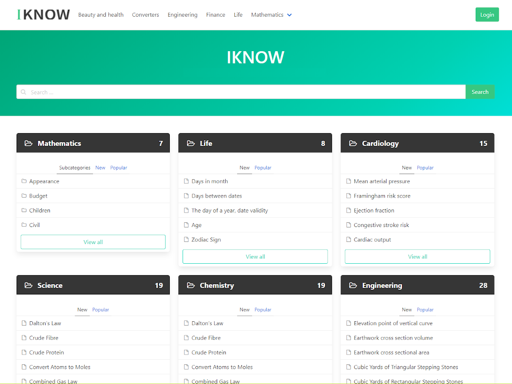

# WordPress Theme Iknow
Iknow WordPress Theme - easily create Knowledge Base, Helpdesk, Wiki and FAQ sites.

## Description

Iknow WordPress Theme has a minimalistic, responsive and mobile-friendly design. Easy and fast theme. The theme is perfect for creating Knowledge Base, Helpdesk, Wiki and FAQ websites. Ability to set custom icons for each category and tag. Manage the display of categories on the main page of the site. The integrated post rating system VoteUp/VoteDown. Breadcrumbs for easy site navigation. Custom widget to display the current navigation in a category and in a separate post. You can view the appearance and features of the theme on the site [https://wow-company.com/wp-theme-iknow/](https://wow-company.com/wp-theme-iknow/)

Theme only support 2 level sub-menus

### Installation

1. In your admin panel, go to Appearance > Themes and click the Add New button.
2. Click Upload Theme and Choose File, then select the theme's .zip file. Click Install Now.
3. Click Activate to use your new theme right away.

### Frequently Asked Questions 

**Which CSS framework this theme use?** 
This theme uses Bulma CSS framework. Bulma is a free, open source CSS framework based on Flexbox. See [https://bulma.io/](https://bulma.io/)

## Copyright

- Iknow WordPress Theme, Copyright 2020 Wow-Company & Dmytro Lobov
- Iknow is distributed under the terms of the GNU GPL

## Changelog
**1.2.6**
* Added: support AMP

**1.2.5**
* Added: search form in the navigation menu
* Added: Attachment page
* Fixed: Sorter post in archive page
* Fixed: Single page navigation

**1.2.4**
* Added: option "Disabled featured image" for posts

**1.2.3**
* Added: option "Post Number" for iknoe home page
* Added: options: 'Sort dropdown color', 'Sort dropdown size'
* Fixed: Iknow Current Nav widget in archive pages

**1.2.2**
* Fixed: section colors in the templates page: Focus,  Full-width, 404

**1.2.1**
* Fixed: title size

**1.2**
* Added: Iknow Current Nav widget style options
* Added: Navigation menu settings: shadow, background color, space, fixed menu.
* Added: Home page settings: panel background, button 'View All' color
* Added: Main color settings: main section background, search button color
* Optimized: style.css

**1.1.4**
* Fixed: white line in mobile devices

**1.1.3**
* Added: page templates: Full-width, Focus
* Added: footer menu
* Added: footer widgets
* Fixed: mobile menu

**1.1.2**
* Fixed: Category title with icon

**1.1.1**
* ixed: Enable icon fonts in theme settings

**1.1**
* Added: Content for Iknow home page
* Added: Links to documentation and changelog

**1.0.7**
* Added: translate to menu aria-label
* Added: support the plugin Iknow Extra

**1.0.6** 
* Fixed: check the helpful function in search.php

**1.0**
* Initial release

## Credits

* Bulma https://bulma.io/, (C) 2019 Jeremy Thomas, [MIT](https://opensource.org/licenses/MIT)
* Font Awesome: https://fontawesome.com/, (c) Dave Gandy, CSS - [MIT](http://opensource.org/licenses/MIT) ; Fonts - [SIL OFL 1.1](http://scripts.sil.org/OFL)
* Font Iknow: this webfont is generated by http://fontello.com open source project. [MIT](http://opensource.org/licenses/MIT)